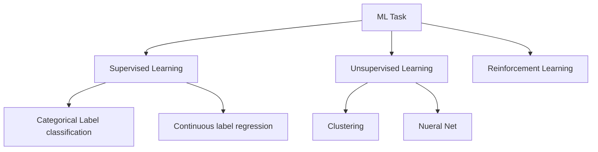

![[Pasted image 20230326135256.png]]

## Define the Problem

mermaid.flowchartConfig = {
    width: 100%
}

```mermaid
graph TD;
	id1[ML Task] --> id2[Supervised Learning]:::fuellungrot;
	id1 --> id3[Unsupervised Learning];
	id1 --> id4[Reinforcement Learning];
	id2 --> id5[Categorical Label classification];
	id2 --> id6[Continuous label regression];
	id3 --> id7[Clustering];
	id3 --> id8[Nueral Net];
```

