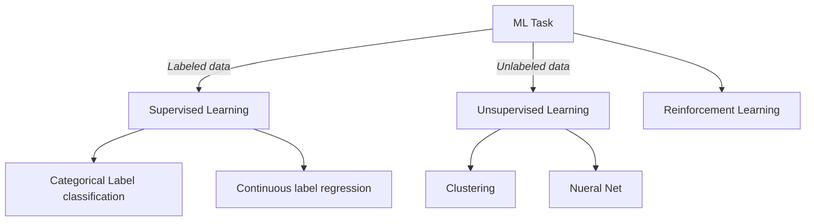

![[Pasted image 20230326135256.png]]

## Define the Problem

### **Step 1: Define a very specific task**  

"How do I increase sales?" It's not a very specific task rather a very broad question.

The following examples demonstrate how a machine learning practitioner might attempt to answer that question.

-   **Question:** Does adding a $1.00 charge for sprinkles on a hot fudge sundae increase the sales of hot fudge sundaes?
-   **Question:** Does adding a $0.50 charge for organic flavors in your snow cone increase the sales of snow cones?

### **Step 2: Identify the machine learning task we might use to solve this problem**

-   This helps you better understand the data you need for a project.

## Building a dataset 

Machine Learning practitioners spend nearly 80% of their time working on preparing data.

- **Data Collection**  - Find and collect data related to the problem you defined

- **Data Inspection** - 
- **Summary Statistics**
- **Data Visualization**

