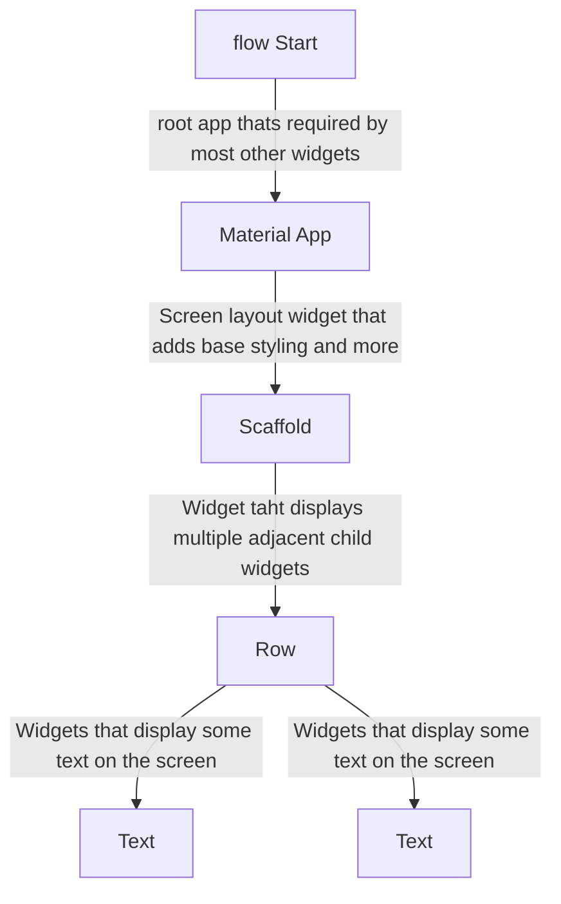

#flutter 
#flutter-ui

Flutter UIs are created by combining and nesting widgets, a tree of widgets (not a bad way to think , refer widget 101). Widgets describe what their view should look like given their current configuration and state.


```
1. main() functions gets executed by dart , when executing the compiled app on the target device.

2. runApp() function inside of main() tells flutter what to display on the screen (i.e which UI elements to display)
	- rupApp() takes an 'widget-tree' as an argument which is a combination of 
	  (nested) flutter widgets that build the overall user interface.
	- The runApp() function takes the given Widget and makes it the root of the
	  widget tree. 
```

Widgets that are subclasses of either **StatelessWidget or StatefulWidget**, depending on whether your widget manages any state. A widget’s main job is to implement a **build() function**, which describes the widget in terms of other, lower-level widgets. The framework builds those widgets in turn until the process bottoms out in widgets that represent the underlying **RenderObject**, which computes and describes the geometry of the widget.

#### Widget tree



- Flutter provides many build-in widgets - buttons, form input,layout widgets
- You can also build custom widgets (based on built-in widgets)
