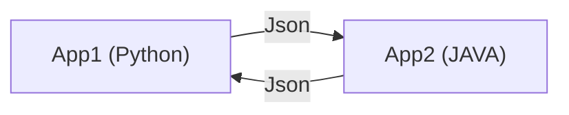

```mermaid
graph LR;
id1["App1 (Python)"] -- Json --> id2["App2 (JAVA)"];
id2 -- Json --> id1;
```

Json - language of communication 
Rest - Representational state transfer (how are we communicating , internet)
API endpoints 
