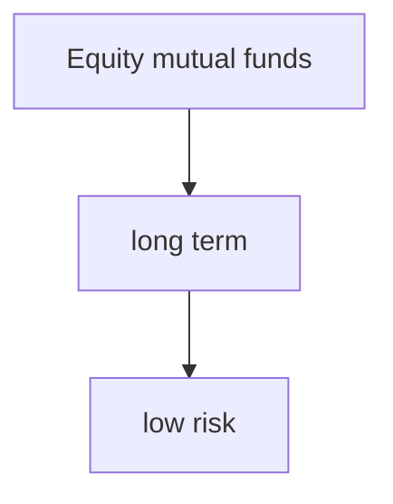

# Equity based mutual fund


### why invest in Equity based mutual funds
1. High returns than bank FDs or post office schemes 
2. Diversification -- as banks invest in more than one company, its safer 
3. Professional Expertise -- banks hire professionals 
4. Requires Low starting investment  , from Rs500/month
5. High Liquidity , jab chahe tab paisa nikal sakte hai
6. Tax Benefits
7. Regulated by #SEBI

Equity based mutual funds are riskier than other types 
### Types of Equity Mutual funds : 
> Market Capitalization  - Market value of a Company = no. of shares * curr market Price / share 
> Based on MC we have 
> a. Large cap companies ( 1st to 100 )
> b. Mid Cap companies ( 101th to 250)
> c.  Small Cap companies ( 251st onward)
>> 1. Large cap funds 
>> 2. Mid Cap Funds
>> 3. Small Cap Funds
>> 4. Large and mid cap funds
>> 5. Multi cap funds

![[/images/MC.png|900]]

> 6. ELSS Equity linked saving scheme 
>> ```mermaid
>>	      graph TD 
>>		  id1[ELSS] --> id2[Tax saving fund]
>>		  id2[Tax saving fund] --> id3[3 years lock in period]
>> ```
> 7. Dividend Yield Fund  -- dividend yearning funds 
> 8. Focused Fund -- maximum 30 stocks 
> 9. Sector/Thematic Fund -- sector wise investment ( ex investing in tech sector or med sector or banking sector)
> 10. Value Fund
> 11. Contra fund